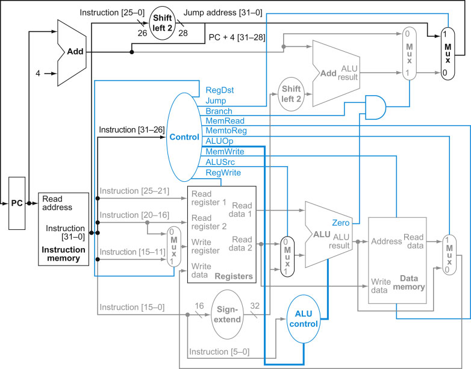
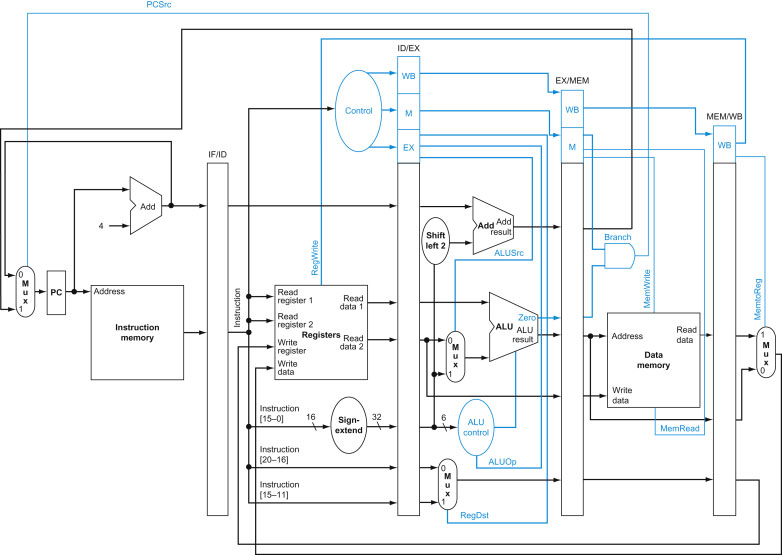

Course Project
====

The first goal of this course is "Design, simulate, and describe the complete operation of a computer system." To complete this goal, you will develop your own implementation of a 32-bit MIPS CPU using Behavioral Verilog. 

Organization
-----
Projects must be completed by groups of 2-3 students. Groups will be assigned in the first lab session. 

Source code will be maintained on Bucknell's [GitLab](http://gitlab.bucknell.edu/) server. 

Documentation will be kept in the `docs` subfolder of your GitLab repository formatted as [GitLab Flavored Markdown (GFM)](https://github.com/gitlabhq/gitlabhq/blob/master/doc/markdown/markdown.md) **use the `.md` extension**. If you forget how to use Git or Gitlab, [see the csci206 lab1 exercise 1-2](http://www.eg.bucknell.edu/~cs206/lab/lab-1/). 

Each milestone has it's own grading rubric (below). Grading will be in group meetings during lab. You must sign-up with your instructor for one of the available grading times. Each group member must be present. Your group will demonstrate each of the items on the rubric and explain the source code. One regrade per milestone (excluding the final milestone) is permitted by appointment up to **72-hours** after the initial attempt. 

You must complete milestones in order, however, you are welcome to complete them as early as you like. The first few are relatively easy, you might want to do them early to give yourself extra time for the harder milestones.

Overview
====

To begin you will be creating a behavioral model of the single-cycle MIPS CPU as shown below in Verilog. There are a few key components: memory, registers, ALU, control and a few minor components: adders, shifters, sign extend, multiplexers. 

Next, you will pipeline your single-cycle CPU. One way to pipeline the system is shown below.

Finally, you will add at least one advanced feature to your CPU to improve performance.

Milestones 
-----

This is a large project, to keep things manageable we will start off slow creating 3 building blocks for the single cycle CPU: memory, regs, and ALU. Once you have a working single cycle CPU, you will improve performance by adding pipelining. Then you will add one advanced feature of your choosing to you pipelined CPU (e.g., dynamic scheduling, branch prediction, speculative execution, multiple issue, predictive cache, etc.). During the last lab session we will benchmark your CPUs. Bonus points will be awarded for the winners.

More details about each milestone is available as a separate document.

Number    | Milestone | Grade Weight | Due by midnight
---       | ----    | ----   | ---- |----
1.        | [Memory](memory.md) | 10% | 9/16/2014 
2.        | [Single-cycle CPU](single.md)   | 25%|  10/7/2014
3.        | [Pipelined CPU](pipeline.md)      | 25%|  11/4/2014
4.        | [Advanced Feature](advanced.md)     | 40% |  11/18/2014
5.        | [Performance Benchmarks](performance.md) | 10% (bonus points) | 12/2/2014

